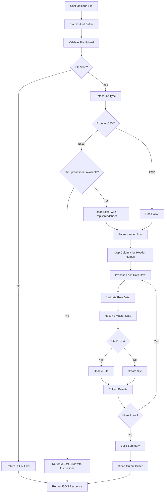

# Design Document: Fix Bulk Upload System

## Overview

This design addresses the critical issues in the bulk upload functionality that currently returns "Invalid JSON response" errors. The solution implements header-based column mapping, comprehensive error handling, and ensures valid JSON responses in all scenarios.

### Current Issues

1. **Fixed Column Position Dependency**: The system expects columns in a specific order, causing failures when users provide data in different arrangements
2. **Invalid JSON Responses**: PHP warnings/errors are output before JSON, breaking the response format
3. **Poor Error Handling**: Exceptions and errors aren't properly caught and converted to JSON
4. **Missing Dependency Detection**: No graceful handling when PhpSpreadsheet library is unavailable
5. **Limited Debugging Information**: Difficult to diagnose issues when uploads fail

### Solution Approach

Implement a robust, header-aware bulk upload system with comprehensive error handling and output buffering to ensure clean JSON responses.

## Architecture

### Component Structure

```
Bulk Upload System
├── Request Handler (Entry Point)
│   ├── Output Buffer Management
│   ├── Error Suppression
│   └── JSON Response Wrapper
├── File Upload Handler
│   ├── File Validation
│   ├── Dependency Detection
│   └── Temporary File Management
├── File Parser
│   ├── Header Detection & Mapping
│   ├── CSV Reader
│   └── Excel Reader (PhpSpreadsheet)
├── Data Processor
│   ├── Row Validator
│   ├── Master Data Resolver
│   └── Site CRUD Operations
└── Response Builder
    ├── Success Response
    ├── Error Response
    └── Detailed Results
```

### Data Flow



## Components and Interfaces

### 1. Request Handler

**Purpose**: Entry point that manages the request lifecycle and ensures clean JSON output

**Key Functions**:
- `handleBulkUploadRequest()`: Main entry point
- `startOutputBuffer()`: Begin output buffering to catch any stray output
- `cleanAndReturnJSON($data)`: Clear buffer and return clean JSON

**Implementation**:
```php
function handleBulkUploadRequest() {
    // Start output buffering to catch any stray output
    ob_start();
    
    // Suppress PHP warnings/notices from appearing in output
    $oldErrorReporting = error_reporting(E_ERROR | E_PARSE);
    
    try {
        // Set JSON header immediately
        header('Content-Type: application/json');
        
        // Process upload
        $result = processUpload();
        
        // Clean buffer and return JSON
        ob_end_clean();
        error_reporting($oldErrorReporting);
        
        echo json_encode($result);
    } catch (Exception $e) {
        // Clean buffer and return error
        ob_end_clean();
        error_reporting($oldErrorReporting);
        
        echo json_encode([
            'success' => false,
            'message' => $e->getMessage()
        ]);
    }
    exit;
}
```

### 2. File Upload Handler

**Purpose**: Validates uploaded files and manages temporary storage

**Key Functions**:
- `validateUploadedFile()`: Check file upload errors and constraints
- `detectFileType()`: Determine if file is CSV or Excel
- `saveTemporaryFile()`: Store uploaded file temporarily
- `cleanupTemporaryFile()`: Remove temporary file after processing

**Validation Rules**:
- File must be present in `$_FILES`
- No PHP upload errors (UPLOAD_ERR_OK)
- File size within limits
- File extension must be .xlsx, .xls, or .csv
- File must not be empty (size > 0)

### 3. File Parser with Header Mapping

**Purpose**: Read file contents and map columns based on header row

**Key Functions**:
- `parseFileWithHeaders($filePath, $fileType)`: Main parsing function
- `readHeaderRow()`: Extract and normalize header names
- `mapColumnIndices($headers)`: Create mapping from column names to indices
- `readDataRows()`: Read all data rows using column mapping

**Column Mapping Strategy**:
```php
// Define expected column names with variations
$columnMap = [
    'site_id' => ['site id', 'siteid', 'site_id', 'site'],
    'store_id' => ['store id', 'storeid', 'store_id', 'store'],
    'location' => ['location', 'address', 'site location'],
    'country' => ['country'],
    'state' => ['state', 'province'],
    'city' => ['city'],
    'zone' => ['zone', 'region'],
    'pincode' => ['pincode', 'pin code', 'postal code', 'zip'],
    'branch' => ['branch', 'branch name'],
    'customer' => ['customer', 'customer name'],
    'contact_person_name' => ['contact person name', 'contact name', 'contact person'],
    'contact_person_number' => ['contact person number', 'contact number', 'phone', 'mobile'],
    'contact_person_email' => ['contact person email', 'contact email', 'email'],
    'po_number' => ['po number', 'po no', 'purchase order', 'po_number'],
    'po_date' => ['po date', 'purchase order date', 'po_date'],
    'remarks' => ['remarks', 'notes', 'comments']
];

// Normalize header (lowercase, trim, remove extra spaces)
function normalizeHeader($header) {
    return strtolower(trim(preg_replace('/\s+/', ' ', $header)));
}

// Map headers to field names
function mapHeaders($headerRow) {
    global $columnMap;
    $mapping = [];
    
    foreach ($headerRow as $index => $header) {
        $normalized = normalizeHeader($header);
        
        foreach ($columnMap as $fieldName => $variations) {
            if (in_array($normalized, $variations)) {
                $mapping[$fieldName] = $index;
                break;
            }
        }
    }
    
    return $mapping;
}
```

### 4. Data Processor

**Purpose**: Validate and process each row of data

**Key Functions**:
- `processRow($rowData, $columnMapping, $rowNumber)`: Process single row
- `validateRowData($data)`: Validate required fields and formats
- `resolveMasterData($data)`: Convert names to foreign key IDs
- `createOrUpdateSite($data)`: Perform database operations

**Validation Flow**:
1. Check required fields (site_id, location)
2. Validate data formats (email, phone, pincode, date)
3. Resolve master data (country, state, city, customer)
4. Check for existing site by site_id
5. Create or update site record
6. Collect detailed results

**Error Handling**:
- Validation errors: Continue to next row, collect error details
- Database errors: Catch exception, log details, return user-friendly message
- Master data not found: Collect specific error, continue processing

### 5. Response Builder

**Purpose**: Construct consistent JSON responses

**Response Structure**:
```json
{
    "success": true|false,
    "message": "Human-readable summary",
    "summary": {
        "processed": 10,
        "created": 5,
        "updated": 3,
        "skipped": 1,
        "failed": 1
    },
    "rows": [
        {
            "row": 2,
            "site_id": "T2FP",
            "location": "Jamnagar Mall",
            "action": "create|update|skip",
            "status": "success|failed",
            "message": "Site created successfully",
            "errors": []
        }
    ],
    "errors": [
        "Row 5: Country 'XYZ' not found in master data"
    ]
}
```

## Data Models

### Input Data Structure (After Mapping)

```php
[
    'site_id' => string,           // Required
    'store_id' => string,          // Optional
    'location' => string,          // Required
    'country' => string,           // Name to resolve
    'state' => string,             // Name to resolve
    'city' => string,              // Name to resolve
    'zone' => string,              // Optional
    'pincode' => string,           // 6 digits
    'branch' => string,            // Optional
    'customer' => string,          // Name to resolve
    'contact_person_name' => string,
    'contact_person_number' => string,
    'contact_person_email' => string,  // Email format
    'po_number' => string,
    'po_date' => string,           // Date format
    'remarks' => string
]
```

### Processed Data Structure (For Database)

```php
[
    'site_id' => string,
    'store_id' => string,
    'location' => string,
    'country_id' => int,           // Resolved from name
    'state_id' => int,             // Resolved from name
    'city_id' => int,              // Resolved from name
    'zone' => string,
    'pincode' => string,
    'branch' => string,
    'customer_id' => int,          // Resolved from name
    'contact_person_name' => string,
    'contact_person_number' => string,
    'contact_person_email' => string,
    'po_number' => string,
    'po_date' => string,           // Y-m-d format
    'remarks' => string,
    'created_by' => 'bulk_upload'
]
```

## Error Handling

### Error Categories

1. **File Upload Errors**
   - No file selected
   - File too large
   - Invalid file type
   - Upload interrupted
   - Server configuration issues

2. **File Processing Errors**
   - Cannot read file
   - Invalid file format
   - Missing header row
   - Required columns missing
   - PhpSpreadsheet not available (for Excel)

3. **Data Validation Errors**
   - Missing required fields
   - Invalid data formats
   - Master data not found
   - Duplicate site_id

4. **Database Errors**
   - Connection failure
   - Query execution failure
   - Constraint violations

### Error Handling Strategy

**Output Buffer Management**:
```php
// Start buffering at the beginning
ob_start();

try {
    // All processing code
} catch (Exception $e) {
    // Clear any output
    ob_end_clean();
    
    // Log detailed error
    error_log("Bulk upload error: " . $e->getMessage());
    error_log("Stack trace: " . $e->getTraceAsString());
    
    // Return user-friendly JSON
    echo json_encode([
        'success' => false,
        'message' => getUserFriendlyMessage($e)
    ]);
}
```

**Error Logging**:
- Log all errors to server error log
- Include context (file name, row number, user ID)
- Log full exception details for debugging
- Never expose sensitive information in user-facing messages

**User-Friendly Messages**:
```php
function getUserFriendlyMessage($exception) {
    $message = $exception->getMessage();
    
    // Database errors
    if (strpos($message, 'SQLSTATE') !== false) {
        return 'Database error occurred. Please contact administrator.';
    }
    
    // File errors
    if (strpos($message, 'PhpSpreadsheet') !== false) {
        return 'Excel file processing requires additional libraries. Please upload a CSV file instead.';
    }
    
    // Default: return original message if it's safe
    return $message;
}
```

## Testing Strategy

### Unit Tests

1. **Header Mapping Tests**
   - Test various header name variations
   - Test case insensitivity
   - Test missing required columns
   - Test extra columns

2. **Validation Tests**
   - Test required field validation
   - Test email format validation
   - Test phone number validation
   - Test pincode validation
   - Test date format validation

3. **Master Data Resolution Tests**
   - Test successful resolution
   - Test missing master data
   - Test case sensitivity

### Integration Tests

1. **CSV Upload Tests**
   - Test successful upload with all fields
   - Test upload with minimal required fields
   - Test upload with invalid data
   - Test upload with mixed valid/invalid rows

2. **Excel Upload Tests**
   - Test with PhpSpreadsheet available
   - Test without PhpSpreadsheet
   - Test date cell handling
   - Test formula cells

3. **Error Handling Tests**
   - Test file upload errors
   - Test database connection errors
   - Test validation errors
   - Test JSON response format

### Manual Testing Checklist

1. Upload CSV with correct column order
2. Upload CSV with different column order
3. Upload CSV with missing optional columns
4. Upload CSV with invalid data
5. Upload Excel file (.xlsx)
6. Upload Excel file (.xls)
7. Upload file with no header row
8. Upload empty file
9. Upload file exceeding size limit
10. Test with database disconnected
11. Test with PhpSpreadsheet unavailable
12. Verify error messages are user-friendly
13. Verify JSON responses are always valid
14. Verify detailed results are accurate

## Implementation Notes

### Dependencies

- **Required**: PHP 7.4+, PDO, MySQL
- **Optional**: PhpSpreadsheet (for Excel support)
- **Fallback**: CSV-only mode when PhpSpreadsheet unavailable

### Performance Considerations

- Process rows in batches if file is very large (>1000 rows)
- Use prepared statements for database operations
- Limit memory usage by processing rows sequentially
- Set appropriate PHP memory limit and execution time

### Security Considerations

- Validate file types strictly
- Sanitize all user input before database operations
- Use prepared statements to prevent SQL injection
- Limit file upload size
- Store uploaded files in secure temporary location
- Clean up temporary files after processing
- Don't expose database structure in error messages
- Log security-relevant events

### Backward Compatibility

- Maintain support for existing CSV format with fixed columns
- Support both header-based and position-based parsing
- Detect presence of header row automatically
- Provide clear migration path for existing users
