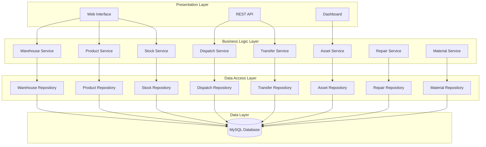
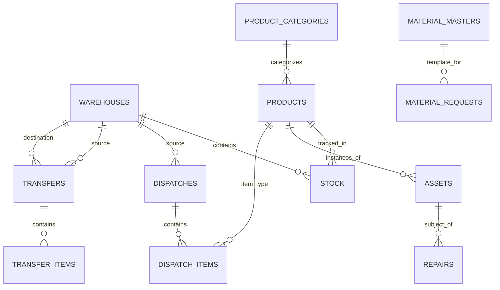

# Design Document

## Overview

The Inventory Management System is designed as a layered, service-oriented architecture that provides comprehensive inventory lifecycle management. The system follows the established ADV CRM patterns with Models, Repositories, Services, and API layers, ensuring consistency with existing codebase patterns while providing robust inventory management capabilities.

The system supports multi-tenant operations with role-based access control, real-time inventory tracking, and comprehensive audit trails. It is built using PHP with MySQL database, following the existing technology stack and architectural patterns.

## Architecture

### System Architecture



### Component Architecture

The system follows a layered architecture pattern:

1. **Presentation Layer**: Web interfaces and REST APIs
2. **Business Logic Layer**: Service classes containing business rules
3. **Data Access Layer**: Repository classes for database operations
4. **Data Layer**: MySQL database with proper indexing and constraints

## Components and Interfaces

### Core Models

#### Warehouse Model
- Properties: id, name, location, address, capacity, status, company_id
- Methods: validate(), isActive(), getCapacityUtilization()

#### Product Model
- Properties: id, name, sku, category_id, description, specifications, unit_of_measure
- Methods: validate(), getCategory(), isActive()

#### ProductCategory Model
- Properties: id, name, description, parent_id, level
- Methods: getChildren(), getParent(), getFullPath()

#### Stock Model
- Properties: id, product_id, warehouse_id, quantity, reserved_quantity, last_updated
- Methods: getAvailableQuantity(), reserve(), release()

#### Asset Model
- Properties: id, product_id, serial_number, barcode, status, location, purchase_date
- Methods: updateLocation(), getHistory(), isAvailable()

#### Dispatch Model
- Properties: id, dispatch_number, source_warehouse_id, destination, status, created_date
- Methods: addItem(), updateStatus(), getItems()

#### Transfer Model
- Properties: id, transfer_number, source_warehouse_id, destination_warehouse_id, status
- Methods: approve(), receive(), cancel()

### Service Layer Interfaces

#### WarehouseService
```php
interface WarehouseServiceInterface {
    public function createWarehouse(array $data): Warehouse;
    public function updateWarehouse(int $id, array $data): Warehouse;
    public function deleteWarehouse(int $id): bool;
    public function getWarehouseById(int $id): ?Warehouse;
    public function getAllWarehouses(): array;
    public function getWarehouseCapacity(int $warehouseId): array;
}
```

#### StockService
```php
interface StockServiceInterface {
    public function addStock(int $productId, int $warehouseId, int $quantity, array $metadata): bool;
    public function reserveStock(int $productId, int $warehouseId, int $quantity): bool;
    public function releaseStock(int $productId, int $warehouseId, int $quantity): bool;
    public function getStockLevel(int $productId, int $warehouseId): int;
    public function getStockHistory(int $productId, ?int $warehouseId = null): array;
}
```

#### DispatchService
```php
interface DispatchServiceInterface {
    public function createDispatch(array $dispatchData, array $items): Dispatch;
    public function updateDispatchStatus(int $dispatchId, string $status): bool;
    public function addDispatchItem(int $dispatchId, int $productId, int $quantity): bool;
    public function getDispatchById(int $id): ?Dispatch;
    public function getDispatchesByStatus(string $status): array;
}
```

## Data Models

### Database Schema

#### Warehouses Table
```sql
CREATE TABLE warehouses (
    id INT PRIMARY KEY AUTO_INCREMENT,
    name VARCHAR(255) NOT NULL,
    code VARCHAR(50) UNIQUE NOT NULL,
    location VARCHAR(255),
    address TEXT,
    capacity DECIMAL(15,2),
    status ENUM('active', 'inactive', 'maintenance') DEFAULT 'active',
    company_id INT NOT NULL,
    created_at TIMESTAMP DEFAULT CURRENT_TIMESTAMP,
    updated_at TIMESTAMP DEFAULT CURRENT_TIMESTAMP ON UPDATE CURRENT_TIMESTAMP,
    INDEX idx_company_status (company_id, status),
    INDEX idx_code (code)
);
```

#### Product Categories Table
```sql
CREATE TABLE product_categories (
    id INT PRIMARY KEY AUTO_INCREMENT,
    name VARCHAR(255) NOT NULL,
    description TEXT,
    parent_id INT NULL,
    level INT DEFAULT 0,
    company_id INT NOT NULL,
    created_at TIMESTAMP DEFAULT CURRENT_TIMESTAMP,
    FOREIGN KEY (parent_id) REFERENCES product_categories(id),
    INDEX idx_parent (parent_id),
    INDEX idx_company (company_id)
);
```

#### Products Table
```sql
CREATE TABLE products (
    id INT PRIMARY KEY AUTO_INCREMENT,
    name VARCHAR(255) NOT NULL,
    sku VARCHAR(100) UNIQUE NOT NULL,
    category_id INT NOT NULL,
    description TEXT,
    specifications JSON,
    unit_of_measure VARCHAR(50),
    minimum_stock_level INT DEFAULT 0,
    status ENUM('active', 'inactive', 'discontinued') DEFAULT 'active',
    company_id INT NOT NULL,
    created_at TIMESTAMP DEFAULT CURRENT_TIMESTAMP,
    updated_at TIMESTAMP DEFAULT CURRENT_TIMESTAMP ON UPDATE CURRENT_TIMESTAMP,
    FOREIGN KEY (category_id) REFERENCES product_categories(id),
    INDEX idx_sku (sku),
    INDEX idx_category (category_id),
    INDEX idx_company_status (company_id, status)
);
```

#### Stock Table
```sql
CREATE TABLE stock (
    id INT PRIMARY KEY AUTO_INCREMENT,
    product_id INT NOT NULL,
    warehouse_id INT NOT NULL,
    quantity DECIMAL(15,2) NOT NULL DEFAULT 0,
    reserved_quantity DECIMAL(15,2) NOT NULL DEFAULT 0,
    last_updated TIMESTAMP DEFAULT CURRENT_TIMESTAMP ON UPDATE CURRENT_TIMESTAMP,
    FOREIGN KEY (product_id) REFERENCES products(id),
    FOREIGN KEY (warehouse_id) REFERENCES warehouses(id),
    UNIQUE KEY unique_product_warehouse (product_id, warehouse_id),
    INDEX idx_warehouse (warehouse_id),
    INDEX idx_product (product_id)
);
```

#### Assets Table
```sql
CREATE TABLE assets (
    id INT PRIMARY KEY AUTO_INCREMENT,
    product_id INT NOT NULL,
    serial_number VARCHAR(255) UNIQUE,
    barcode VARCHAR(255) UNIQUE,
    status ENUM('available', 'dispatched', 'in_repair', 'retired') DEFAULT 'available',
    current_location_type ENUM('warehouse', 'dispatch', 'repair', 'site'),
    current_location_id INT,
    purchase_date DATE,
    warranty_expiry DATE,
    company_id INT NOT NULL,
    created_at TIMESTAMP DEFAULT CURRENT_TIMESTAMP,
    updated_at TIMESTAMP DEFAULT CURRENT_TIMESTAMP ON UPDATE CURRENT_TIMESTAMP,
    FOREIGN KEY (product_id) REFERENCES products(id),
    INDEX idx_serial (serial_number),
    INDEX idx_barcode (barcode),
    INDEX idx_status (status),
    INDEX idx_company (company_id)
);
```

### Entity Relationships



## Correctness Properties

*A property is a characteristic or behavior that should hold true across all valid executions of a system-essentially, a formal statement about what the system should do. Properties serve as the bridge between human-readable specifications and machine-verifiable correctness guarantees.*

Based on the prework analysis, I'll now define the key correctness properties that must be maintained by the system:

**Property 1: Warehouse Creation Uniqueness**
*For any* valid warehouse data, creating a warehouse should result in a stored warehouse with unique identification that can be retrieved
**Validates: Requirements 1.1**

**Property 2: Warehouse Listing Completeness**
*For any* company, listing warehouses should return all warehouses belonging to that company with their current information
**Validates: Requirements 1.2**

**Property 3: Warehouse Update Consistency**
*For any* valid warehouse update data, updating a warehouse should result in the warehouse record reflecting the new information
**Validates: Requirements 1.3**

**Property 4: Warehouse Deletion Protection**
*For any* warehouse with existing inventory, attempting to delete the warehouse should be prevented and return an appropriate error
**Validates: Requirements 1.4**

**Property 5: Stock Level Consistency**
*For any* stock addition or removal operation, the resulting stock level should equal the previous level plus additions minus removals
**Validates: Requirements 3.2**

**Property 6: Dispatch Stock Validation**
*For any* dispatch creation request, the system should only allow the dispatch if sufficient stock is available in the source warehouse
**Validates: Requirements 4.1**

**Property 7: Dispatch Stock Reduction**
*For any* successful dispatch creation, the source warehouse stock levels should be reduced by exactly the dispatched quantities
**Validates: Requirements 4.2**

**Property 8: Transfer Stock Conservation**
*For any* completed transfer, the total stock across both source and destination warehouses should remain constant (source decrease equals destination increase)
**Validates: Requirements 5.2, 5.3**

**Property 9: Asset Identity Uniqueness**
*For any* asset registration, the system should assign unique identifiers (serial numbers, barcodes) that remain unique across all assets
**Validates: Requirements 6.1**

**Property 10: Asset Location Tracking**
*For any* asset location change, the system should maintain complete location history while updating the current location
**Validates: Requirements 6.2**

**Property 11: Audit Trail Completeness**
*For any* sensitive operation (stock changes, dispatches, transfers), the system should create audit log entries with complete information
**Validates: Requirements 1.5, 3.4, 5.4, 12.2**

**Property 12: Permission Validation**
*For any* user attempting to access system functions, the system should validate permissions based on the user's roles and only allow authorized access
**Validates: Requirements 12.1**

**Property 13: Data Consistency Across Operations**
*For any* inventory operation affecting multiple entities, all related entities should remain in a consistent state after the operation completes
**Validates: Requirements 11.1**

**Property 14: Concurrent Operation Safety**
*For any* set of concurrent operations on the same inventory items, the final state should be equivalent to some sequential execution of those operations
**Validates: Requirements 11.2**

**Property 15: Category Deletion Protection**
*For any* product category with assigned products, attempting to delete the category should be prevented and return an appropriate error
**Validates: Requirements 2.5**

## Error Handling

### Error Categories

1. **Validation Errors**: Invalid input data, constraint violations
2. **Business Rule Errors**: Insufficient stock, unauthorized operations
3. **System Errors**: Database connectivity, service unavailability
4. **Security Errors**: Authentication failures, permission denials

### Error Response Strategy

- All errors should return consistent error response format
- Error messages should be user-friendly while maintaining security
- Critical errors should be logged with full context
- Transient errors should include retry guidance

### Exception Hierarchy

```php
abstract class InventoryException extends Exception {}

class ValidationException extends InventoryException {}
class InsufficientStockException extends InventoryException {}
class UnauthorizedOperationException extends InventoryException {}
class EntityNotFoundException extends InventoryException {}
class ConcurrencyException extends InventoryException {}
```

## Testing Strategy

### Dual Testing Approach

The system will implement both unit testing and property-based testing to ensure comprehensive coverage:

**Unit Testing**:
- Specific examples that demonstrate correct behavior
- Edge cases and error conditions
- Integration points between components
- Mock external dependencies for isolated testing

**Property-Based Testing**:
- Universal properties that should hold across all inputs
- Uses QuickCheck-style property testing library for PHP (Eris)
- Each property-based test will run a minimum of 100 iterations
- Tests will generate random valid inputs to verify properties

**Property-Based Testing Requirements**:
- Use Eris library for PHP property-based testing
- Configure each property test to run minimum 100 iterations
- Tag each property test with format: `**Feature: inventory-management-system, Property {number}: {property_text}**`
- Each correctness property must be implemented by a single property-based test
- Generate smart test data that respects business constraints

**Testing Coverage**:
- Unit tests verify specific examples and integration points
- Property tests verify universal correctness properties
- Both approaches are complementary and required for comprehensive validation

### Test Data Generation

Property-based tests will use intelligent generators that:
- Respect business constraints (positive quantities, valid dates)
- Generate realistic data distributions
- Include edge cases naturally through random generation
- Maintain referential integrity in generated data

### Integration Testing

- Test complete workflows (create product → add stock → create dispatch)
- Verify cross-service communication
- Test transaction boundaries and rollback scenarios
- Validate audit trail generation across operations

## Performance Considerations

### Database Optimization

- Proper indexing on frequently queried columns
- Partitioning for large audit tables
- Connection pooling for high-concurrency scenarios
- Query optimization for complex reporting

### Caching Strategy

- Cache frequently accessed reference data (products, categories)
- Cache computed metrics for dashboard display
- Implement cache invalidation on data changes
- Use Redis for distributed caching if needed

### Scalability Patterns

- Horizontal scaling through database sharding by company_id
- Asynchronous processing for non-critical operations
- Event-driven architecture for audit logging
- API rate limiting to prevent abuse

## Security Considerations

### Data Protection

- Encrypt sensitive data at rest
- Use HTTPS for all API communications
- Implement proper input validation and sanitization
- Protect against SQL injection through prepared statements

### Access Control

- Role-based access control (RBAC) implementation
- Company-level data isolation
- API authentication using JWT tokens
- Session management with secure cookies

### Audit and Compliance

- Comprehensive audit logging for all operations
- Immutable audit trails
- Data retention policies
- Compliance with data protection regulations

## Deployment Architecture

### Environment Configuration

- Development: Local MySQL, file-based sessions
- Staging: Replicated production setup for testing
- Production: High-availability MySQL cluster, Redis sessions

### Monitoring and Alerting

- Application performance monitoring
- Database performance metrics
- Business metrics (stock levels, dispatch volumes)
- Error rate and response time alerting

### Backup and Recovery

- Automated daily database backups
- Point-in-time recovery capability
- Disaster recovery procedures
- Data integrity verification