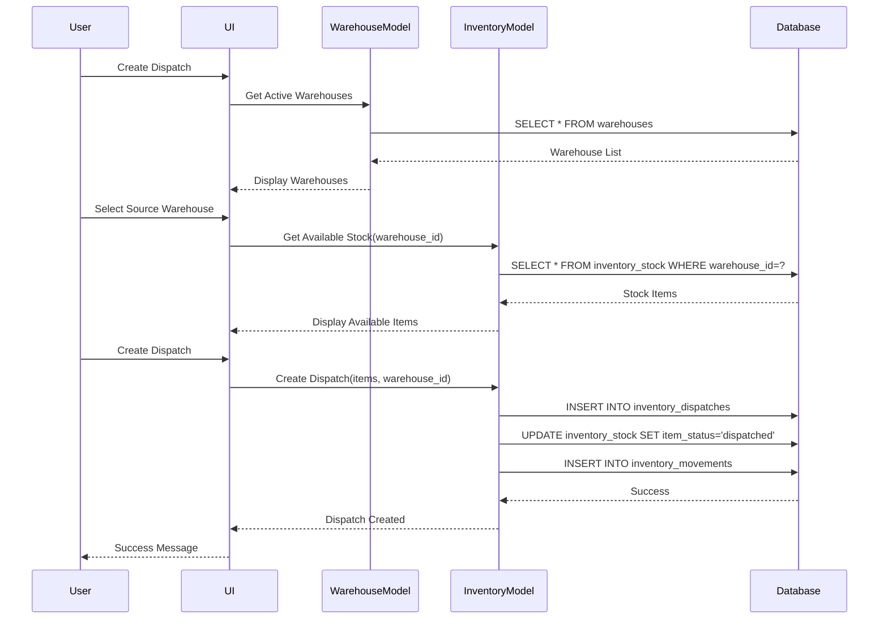

# Design Document

## Overview

This design document outlines the technical approach for implementing multi-warehouse inventory management functionality. The system will be extended from a single-location inventory to support multiple warehouse locations with full tracking, transfer capabilities, and warehouse-specific stock management.

The design follows the existing architecture patterns in the application, utilizing the BaseMaster model for warehouse management, extending the Inventory model for warehouse-aware operations, and creating new database tables and views to support warehouse-specific tracking.

## Architecture

### High-Level Architecture

```
┌─────────────────────────────────────────────────────────────┐
│                     Presentation Layer                       │
│  ┌──────────────┐  ┌──────────────┐  ┌──────────────┐      │
│  │  Warehouse   │  │  Inventory   │  │  Dispatch    │      │
│  │  Management  │  │  Management  │  │  Management  │      │
│  └──────────────┘  └──────────────┘  └──────────────┘      │
└─────────────────────────────────────────────────────────────┘
                            │
┌─────────────────────────────────────────────────────────────┐
│                      Business Logic Layer                    │
│  ┌──────────────┐  ┌──────────────┐  ┌──────────────┐      │
│  │  Warehouse   │  │  Inventory   │  │  Transfer    │      │
│  │  Model       │  │  Model       │  │  Model       │      │
│  └──────────────┘  └──────────────┘  └──────────────┘      │
└─────────────────────────────────────────────────────────────┘
                            │
┌─────────────────────────────────────────────────────────────┐
│                       Data Layer                             │
│  ┌──────────────┐  ┌──────────────┐  ┌──────────────┐      │
│  │  warehouses  │  │  inventory_  │  │  warehouse_  │      │
│  │              │  │  stock       │  │  transfers   │      │
│  └──────────────┘  └──────────────┘  └──────────────┘      │
└─────────────────────────────────────────────────────────────┘
```

### Component Interaction Flow



## Components and Interfaces

### 1. Warehouse Model

**File:** `models/Warehouse.php`

**Purpose:** Manage warehouse master data including CRUD operations, validation, and warehouse-specific queries.

**Class Structure:**
```php
class Warehouse extends BaseMaster {
    protected $table = 'warehouses';
    
    // Core Methods
    public function create($data): int|false
    public function update($id, $data): bool
    public function find($id): array|false
    public function getActive(): array
    public function getWarehouseWithStockSummary($id): array
    public function validateWarehouseData($data, $isUpdate, $recordId): array
    
    // Warehouse-specific Methods
    public function getWarehouseStockLevels($warehouseId): array
    public function getWarehouseLowStockItems($warehouseId, $threshold): array
    public function getWarehouseStats($warehouseId): array
}
```

**Key Attributes:**
- `id`: Primary key
- `warehouse_code`: Unique identifier (auto-generated)
- `name`: Warehouse name
- `address`: Full address
- `city`: City name
- `state`: State name
- `pincode`: Postal code
- `contact_person`: Contact person name
- `contact_phone`: Contact phone number
- `contact_email`: Contact email
- `is_default`: Boolean flag for default warehouse
- `status`: active/inactive
- `created_at`, `updated_at`: Timestamps

### 2. Enhanced Inventory Model

**File:** `models/Inventory.php` (modifications)

**New/Modified Methods:**

```php
// Modified to include warehouse filtering
public function getStockOverview($search, $category, $lowStock, $warehouseId = null): array

// Modified to filter by warehouse
public function getAvailableStock($boqItemId, $requiredQuantity, $warehouseId): array

// Modified to assign warehouse
public function addIndividualStockEntry($data): int|false

// New method for warehouse-specific stock
public function getWarehouseStock($warehouseId, $boqItemId = null): array

// Modified to include source warehouse
public function createDispatch($data): int|false

// New method for stock distribution across warehouses
public function getStockDistribution($boqItemId): array
```

### 3. Warehouse Transfer Model

**File:** `models/WarehouseTransfer.php`

**Purpose:** Handle inter-warehouse material transfers.

**Class Structure:**
```php
class WarehouseTransfer extends BaseModel {
    protected $table = 'warehouse_transfers';
    
    public function createTransfer($data): int|false
    public function getTransferDetails($id): array|false
    public function updateTransferStatus($id, $status, $userId): bool
    public function completeTransfer($id, $userId): bool
    public function getTransfers($filters, $page, $limit): array
    public function validateTransfer($data): array
    
    // Private helper methods
    private function moveStockItems($transferId, $items): bool
    private function createMovementRecords($transferId, $items): bool
}
```

### 4. Warehouse Management Controller

**File:** `controllers/WarehousesController.php`

**Purpose:** Handle HTTP requests for warehouse operations.

**Methods:**
- `index()`: List all warehouses
- `create()`: Show create form
- `store()`: Save new warehouse
- `edit($id)`: Show edit form
- `update($id)`: Update warehouse
- `delete($id)`: Delete warehouse
- `toggleStatus($id)`: Activate/deactivate warehouse
- `stockSummary($id)`: Show warehouse stock summary

### 5. User Interface Components

#### Warehouse Management Pages

**Location:** `admin/masters/warehouses/`

**Pages:**
- `index.php`: List all warehouses with search/filter
- `add.php`: Create new warehouse form
- `edit.php`: Edit warehouse form
- `view.php`: View warehouse details with stock summary

#### Modified Inventory Pages

**Location:** `admin/inventory/`

**Modified Pages:**
- `index.php`: Add warehouse filter dropdown
- `inwards/add-inward.php`: Add warehouse selection
- `dispatches/create-dispatch.php`: Add source warehouse selection
- `stock-entries/add-individual-stock.php`: Add warehouse selection

#### New Transfer Management Pages

**Location:** `admin/inventory/transfers/`

**Pages:**
- `index.php`: List all transfers
- `create-transfer.php`: Create new transfer
- `view-transfer.php`: View transfer details
- `complete-transfer.php`: Mark transfer as completed

## Data Models

### Database Schema Changes

#### 1. New Table: `warehouses`

```sql
CREATE TABLE warehouses (
    id INT PRIMARY KEY AUTO_INCREMENT,
    warehouse_code VARCHAR(50) UNIQUE NOT NULL,
    name VARCHAR(255) NOT NULL,
    address TEXT NOT NULL,
    city VARCHAR(100),
    state VARCHAR(100),
    pincode VARCHAR(20),
    contact_person VARCHAR(255) NOT NULL,
    contact_phone VARCHAR(20) NOT NULL,
    contact_email VARCHAR(255),
    is_default BOOLEAN DEFAULT FALSE,
    status ENUM('active', 'inactive') DEFAULT 'active',
    created_at TIMESTAMP DEFAULT CURRENT_TIMESTAMP,
    updated_at TIMESTAMP DEFAULT CURRENT_TIMESTAMP ON UPDATE CURRENT_TIMESTAMP,
    created_by INT,
    updated_by INT,
    
    FOREIGN KEY (created_by) REFERENCES users(id),
    FOREIGN KEY (updated_by) REFERENCES users(id),
    INDEX idx_status (status),
    INDEX idx_warehouse_code (warehouse_code)
) ENGINE=InnoDB DEFAULT CHARSET=utf8mb4 COLLATE=utf8mb4_unicode_ci;
```

#### 2. Modified Table: `inventory_stock`

**Add Column:**
```sql
ALTER TABLE inventory_stock 
ADD COLUMN warehouse_id INT NOT NULL DEFAULT 1 AFTER boq_item_id,
ADD FOREIGN KEY (warehouse_id) REFERENCES warehouses(id),
ADD INDEX idx_warehouse_stock (warehouse_id, boq_item_id, item_status);
```

#### 3. Modified Table: `inventory_inwards`

**Add Column:**
```sql
ALTER TABLE inventory_inwards 
ADD COLUMN warehouse_id INT NOT NULL AFTER receipt_number,
ADD FOREIGN KEY (warehouse_id) REFERENCES warehouses(id),
ADD INDEX idx_warehouse_inward (warehouse_id);
```

#### 4. Modified Table: `inventory_dispatches`

**Add Column:**
```sql
ALTER TABLE inventory_dispatches 
ADD COLUMN source_warehouse_id INT NOT NULL AFTER dispatch_number,
ADD FOREIGN KEY (source_warehouse_id) REFERENCES warehouses(id),
ADD INDEX idx_warehouse_dispatch (source_warehouse_id);
```

#### 5. New Table: `warehouse_transfers`

```sql
CREATE TABLE warehouse_transfers (
    id INT PRIMARY KEY AUTO_INCREMENT,
    transfer_number VARCHAR(50) UNIQUE NOT NULL,
    transfer_date DATE NOT NULL,
    source_warehouse_id INT NOT NULL,
    destination_warehouse_id INT NOT NULL,
    transfer_status ENUM('pending', 'in_transit', 'completed', 'cancelled') DEFAULT 'pending',
    total_items INT DEFAULT 0,
    total_value DECIMAL(12,2) DEFAULT 0.00,
    initiated_by INT NOT NULL,
    completed_by INT,
    completed_at TIMESTAMP NULL,
    transfer_notes TEXT,
    created_at TIMESTAMP DEFAULT CURRENT_TIMESTAMP,
    updated_at TIMESTAMP DEFAULT CURRENT_TIMESTAMP ON UPDATE CURRENT_TIMESTAMP,
    
    FOREIGN KEY (source_warehouse_id) REFERENCES warehouses(id),
    FOREIGN KEY (destination_warehouse_id) REFERENCES warehouses(id),
    FOREIGN KEY (initiated_by) REFERENCES users(id),
    FOREIGN KEY (completed_by) REFERENCES users(id),
    INDEX idx_transfer_date (transfer_date),
    INDEX idx_warehouses (source_warehouse_id, destination_warehouse_id),
    INDEX idx_status (transfer_status),
    
    CONSTRAINT chk_different_warehouses CHECK (source_warehouse_id != destination_warehouse_id)
) ENGINE=InnoDB DEFAULT CHARSET=utf8mb4 COLLATE=utf8mb4_unicode_ci;
```

#### 6. New Table: `warehouse_transfer_items`

```sql
CREATE TABLE warehouse_transfer_items (
    id INT PRIMARY KEY AUTO_INCREMENT,
    transfer_id INT NOT NULL,
    inventory_stock_id INT NOT NULL,
    boq_item_id INT NOT NULL,
    unit_cost DECIMAL(10,2) NOT NULL,
    transfer_notes TEXT,
    created_at TIMESTAMP DEFAULT CURRENT_TIMESTAMP,
    
    FOREIGN KEY (transfer_id) REFERENCES warehouse_transfers(id) ON DELETE CASCADE,
    FOREIGN KEY (inventory_stock_id) REFERENCES inventory_stock(id),
    FOREIGN KEY (boq_item_id) REFERENCES boq_items(id),
    INDEX idx_transfer (transfer_id),
    INDEX idx_stock (inventory_stock_id),
    INDEX idx_boq_item (boq_item_id),
    
    UNIQUE KEY unique_stock_transfer (inventory_stock_id, transfer_id)
) ENGINE=InnoDB DEFAULT CHARSET=utf8mb4 COLLATE=utf8mb4_unicode_ci;
```

#### 7. Modified Table: `inventory_movements`

**Add Column:**
```sql
ALTER TABLE inventory_movements 
ADD COLUMN source_warehouse_id INT AFTER from_location,
ADD COLUMN destination_warehouse_id INT AFTER to_location,
ADD FOREIGN KEY (source_warehouse_id) REFERENCES warehouses(id),
ADD FOREIGN KEY (destination_warehouse_id) REFERENCES warehouses(id),
ADD INDEX idx_warehouse_movement (source_warehouse_id, destination_warehouse_id);
```

#### 8. Updated View: `inventory_summary`

```sql
DROP VIEW IF EXISTS inventory_summary;

CREATE VIEW inventory_summary AS
SELECT 
    bi.id as boq_item_id,
    bi.item_name,
    bi.item_code,
    bi.unit,
    bi.category,
    bi.icon_class,
    
    -- Overall stock counts
    COUNT(CASE WHEN ist.item_status = 'available' THEN 1 END) as available_stock,
    COUNT(CASE WHEN ist.item_status = 'dispatched' THEN 1 END) as dispatched_stock,
    COUNT(CASE WHEN ist.item_status = 'delivered' THEN 1 END) as delivered_stock,
    COUNT(CASE WHEN ist.item_status = 'returned' THEN 1 END) as returned_stock,
    COUNT(CASE WHEN ist.item_status = 'damaged' THEN 1 END) as damaged_stock,
    COUNT(*) as total_stock,
    
    -- Financial summary
    AVG(ist.unit_cost) as avg_unit_cost,
    SUM(CASE WHEN ist.item_status = 'available' THEN ist.unit_cost ELSE 0 END) as available_value,
    SUM(ist.unit_cost) as total_value,
    
    -- Warehouse distribution
    COUNT(DISTINCT ist.warehouse_id) as warehouse_count
    
FROM boq_items bi
LEFT JOIN inventory_stock ist ON bi.id = ist.boq_item_id
WHERE bi.status = 'active'
GROUP BY bi.id, bi.item_name, bi.item_code, bi.unit, bi.category, bi.icon_class;
```

#### 9. New View: `warehouse_stock_summary`

```sql
CREATE VIEW warehouse_stock_summary AS
SELECT 
    w.id as warehouse_id,
    w.warehouse_code,
    w.name as warehouse_name,
    bi.id as boq_item_id,
    bi.item_name,
    bi.item_code,
    bi.unit,
    bi.category,
    
    -- Stock counts by status
    COUNT(CASE WHEN ist.item_status = 'available' THEN 1 END) as available_stock,
    COUNT(CASE WHEN ist.item_status = 'dispatched' THEN 1 END) as dispatched_stock,
    COUNT(CASE WHEN ist.item_status = 'delivered' THEN 1 END) as delivered_stock,
    COUNT(*) as total_stock,
    
    -- Financial summary
    AVG(ist.unit_cost) as avg_unit_cost,
    SUM(CASE WHEN ist.item_status = 'available' THEN ist.unit_cost ELSE 0 END) as available_value,
    SUM(ist.unit_cost) as total_value
    
FROM warehouses w
CROSS JOIN boq_items bi
LEFT JOIN inventory_stock ist ON w.id = ist.warehouse_id AND bi.id = ist.boq_item_id
WHERE w.status = 'active' AND bi.status = 'active'
GROUP BY w.id, w.warehouse_code, w.name, bi.id, bi.item_name, bi.item_code, bi.unit, bi.category;
```

### Migration Strategy

**File:** `database/add_multi_warehouse_support.php`

**Migration Steps:**

1. Create `warehouses` table
2. Insert default Mumbai warehouse
3. Add `warehouse_id` column to `inventory_stock` with default value 1 (Mumbai)
4. Add `warehouse_id` column to `inventory_inwards`
5. Add `source_warehouse_id` column to `inventory_dispatches`
6. Create `warehouse_transfers` and `warehouse_transfer_items` tables
7. Add warehouse columns to `inventory_movements`
8. Update `inventory_summary` view
9. Create `warehouse_stock_summary` view
10. Create audit log entry for migration
11. Update all existing records to reference Mumbai warehouse

## Error Handling

### Validation Rules

**Warehouse Creation/Update:**
- Warehouse name: Required, 2-255 characters, unique
- Address: Required
- Contact person: Required
- Contact phone: Required, valid phone format
- Contact email: Optional, valid email format if provided
- Status: Must be 'active' or 'inactive'

**Inter-Warehouse Transfer:**
- Source and destination warehouses must be different
- Source warehouse must have sufficient stock
- All items must exist and be available
- Transfer cannot be completed if status is 'cancelled'

**Dispatch Creation:**
- Source warehouse must be active
- Selected items must be available in the source warehouse
- Quantity must not exceed available stock in warehouse

### Error Responses

**Common Error Scenarios:**

1. **Insufficient Stock in Warehouse**
   - HTTP 400: "Insufficient stock in [Warehouse Name]. Requested: X, Available: Y"

2. **Invalid Warehouse Transfer**
   - HTTP 400: "Cannot transfer materials to the same warehouse"

3. **Inactive Warehouse**
   - HTTP 400: "Cannot receive/dispatch materials from inactive warehouse"

4. **Warehouse Not Found**
   - HTTP 404: "Warehouse not found"

5. **Duplicate Warehouse Code**
   - HTTP 409: "Warehouse code already exists"

### Logging Strategy

**Log Events:**
- Warehouse creation/update/deletion
- Stock movements between warehouses
- Dispatch from specific warehouse
- Inward receipt to specific warehouse
- Transfer initiation and completion
- Warehouse status changes

**Log Format:**
```php
[
    'event' => 'warehouse_transfer_completed',
    'transfer_id' => 123,
    'source_warehouse' => 'Mumbai',
    'destination_warehouse' => 'Pune',
    'items_count' => 15,
    'total_value' => 45000.00,
    'user_id' => 5,
    'timestamp' => '2025-12-04 10:30:00'
]
```

## Testing Strategy

### Unit Tests

**Warehouse Model Tests:**
- Test warehouse creation with valid data
- Test warehouse creation with invalid data
- Test warehouse code auto-generation
- Test warehouse status toggle
- Test warehouse stock summary retrieval

**Inventory Model Tests:**
- Test stock filtering by warehouse
- Test dispatch creation with warehouse
- Test stock availability check per warehouse
- Test stock distribution across warehouses

**Transfer Model Tests:**
- Test transfer creation
- Test transfer validation (same warehouse check)
- Test transfer completion
- Test stock movement during transfer

### Integration Tests

**Warehouse-Inventory Integration:**
- Test inward receipt to specific warehouse updates stock correctly
- Test dispatch from warehouse reduces stock correctly
- Test transfer between warehouses updates both warehouses

**End-to-End Scenarios:**
1. Create warehouse → Receive materials → Dispatch materials
2. Create warehouse → Receive materials → Transfer to another warehouse → Dispatch from destination
3. View stock distribution across multiple warehouses
4. Generate warehouse-specific reports

### Manual Testing Checklist

**Warehouse Management:**
- [ ] Create new warehouse with all fields
- [ ] Edit existing warehouse
- [ ] Toggle warehouse status
- [ ] View warehouse stock summary
- [ ] Delete warehouse (should fail if has stock)

**Inventory Operations:**
- [ ] Receive materials into specific warehouse
- [ ] View stock filtered by warehouse
- [ ] Create dispatch from specific warehouse
- [ ] Verify stock levels update correctly

**Transfer Operations:**
- [ ] Create transfer between warehouses
- [ ] Complete transfer
- [ ] Verify stock moves from source to destination
- [ ] Cancel transfer
- [ ] View transfer history

**Reporting:**
- [ ] Generate warehouse-wise stock report
- [ ] View material distribution across warehouses
- [ ] Export warehouse movement reports
- [ ] View dispatch history by warehouse

### Performance Considerations

**Database Optimization:**
- Indexes on `warehouse_id` in all relevant tables
- Composite indexes for common query patterns (warehouse_id + boq_item_id + item_status)
- Use of views for complex aggregations
- Pagination for large result sets

**Caching Strategy:**
- Cache active warehouses list (TTL: 1 hour)
- Cache warehouse stock summaries (TTL: 5 minutes)
- Invalidate cache on stock movements

**Query Optimization:**
- Use prepared statements for all queries
- Avoid N+1 queries by using JOINs
- Use EXPLAIN to analyze slow queries
- Consider materialized views for complex reports

## Security Considerations

**Access Control:**
- Only inventory managers can create/edit warehouses
- Only inventory managers can create transfers
- Vendors can only view dispatches from warehouses (read-only)
- Audit all warehouse-related operations

**Data Validation:**
- Sanitize all user inputs
- Validate warehouse IDs exist before operations
- Prevent SQL injection through prepared statements
- Validate file uploads for warehouse documents

**Business Logic Security:**
- Prevent negative stock levels
- Prevent transfers to inactive warehouses
- Prevent dispatch from warehouses without stock
- Enforce unique warehouse codes

## Deployment Plan

**Phase 1: Database Migration**
1. Backup production database
2. Run migration script to create tables and columns
3. Verify data integrity
4. Create Mumbai warehouse and assign existing stock

**Phase 2: Code Deployment**
1. Deploy Warehouse model
2. Deploy modified Inventory model
3. Deploy WarehouseTransfer model
4. Deploy controllers

**Phase 3: UI Deployment**
1. Deploy warehouse management pages
2. Deploy modified inventory pages
3. Deploy transfer management pages
4. Update navigation menus

**Phase 4: Testing & Validation**
1. Verify all existing functionality works
2. Test new warehouse features
3. Test transfer functionality
4. Generate test reports

**Phase 5: User Training**
1. Train inventory managers on new features
2. Provide documentation
3. Monitor for issues

## Future Enhancements

**Potential Features:**
- Warehouse capacity management
- Automated stock rebalancing suggestions
- Warehouse-specific pricing
- Multi-warehouse order fulfillment optimization
- Warehouse performance analytics
- Mobile app for warehouse operations
- Barcode/QR code scanning for transfers
- Integration with logistics providers
