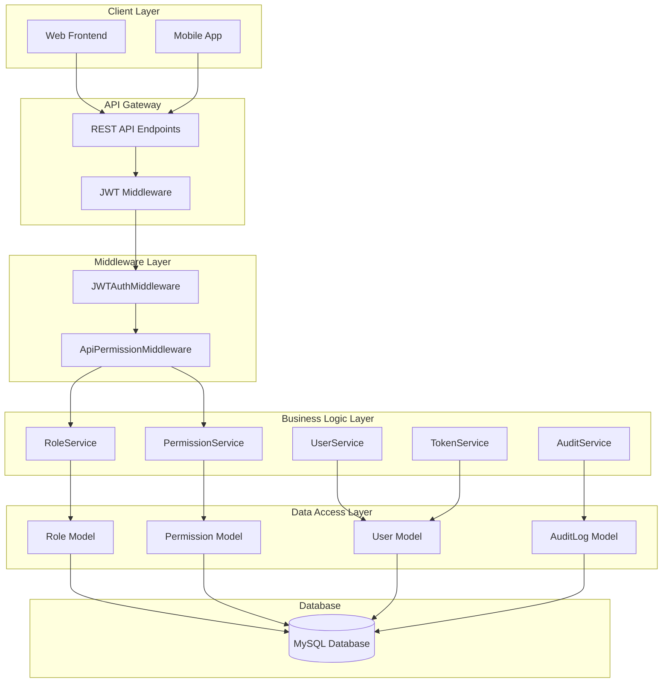
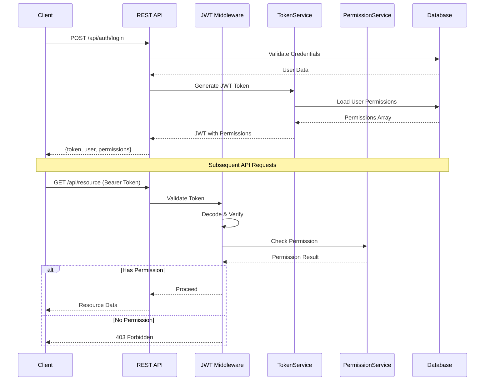
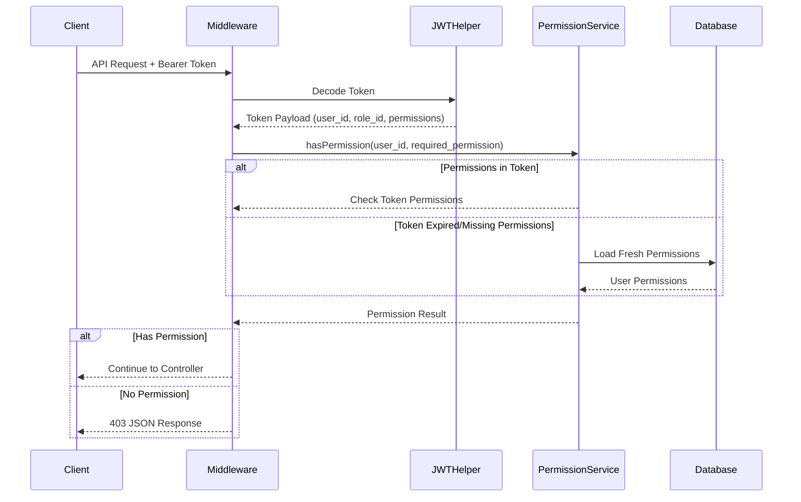
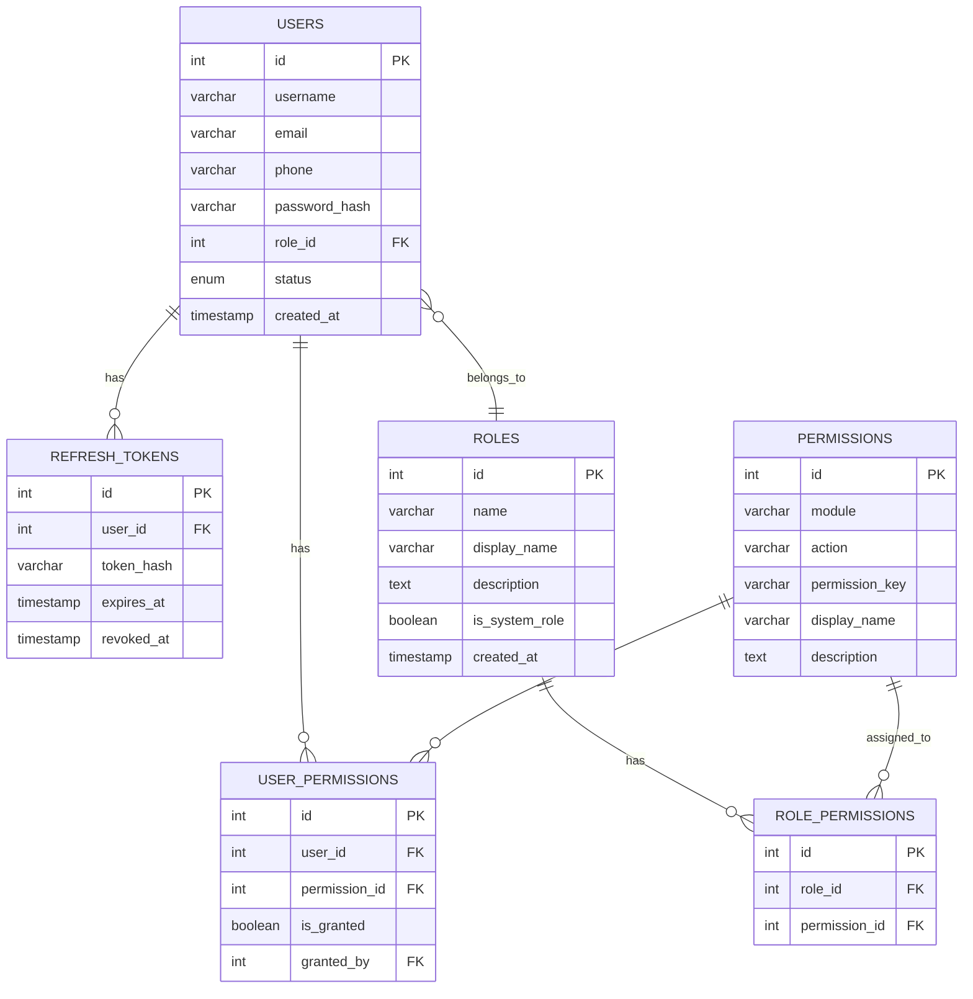

# Design Document: Role-Based Access Control (RBAC) System

## Overview

This document outlines the technical design for implementing a comprehensive Role-Based Access Control (RBAC) system to replace the existing menu-based access control. The system uses JWT-based authentication with REST API architecture for all operations, providing granular permission management across all modules.

## Architecture

### High-Level Architecture



### JWT Authentication Flow



### Permission Check Flow



## Components and Interfaces

### 1. REST API Endpoints

#### Authentication API (`api/auth/`)

| Method | Endpoint | Description | Permission |
|--------|----------|-------------|------------|
| POST | /api/auth/login | User login, returns JWT | Public |
| POST | /api/auth/logout | Invalidate token | Authenticated |
| POST | /api/auth/refresh | Refresh JWT token | Authenticated |
| GET | /api/auth/me | Get current user info | Authenticated |

#### Roles API (`api/roles/`)

| Method | Endpoint | Description | Permission |
|--------|----------|-------------|------------|
| GET | /api/roles | List all roles | users.manage_roles |
| GET | /api/roles/{id} | Get role details | users.manage_roles |
| POST | /api/roles | Create new role | users.manage_roles |
| PUT | /api/roles/{id} | Update role | users.manage_roles |
| DELETE | /api/roles/{id} | Delete role | users.manage_roles |
| GET | /api/roles/{id}/permissions | Get role permissions | users.manage_roles |
| PUT | /api/roles/{id}/permissions | Update role permissions | users.manage_roles |

#### Permissions API (`api/permissions/`)

| Method | Endpoint | Description | Permission |
|--------|----------|-------------|------------|
| GET | /api/permissions | List all permissions | users.manage_roles |
| GET | /api/permissions/grouped | Get permissions by module | users.manage_roles |

#### Users API (`api/users/`)

| Method | Endpoint | Description | Permission |
|--------|----------|-------------|------------|
| GET | /api/users | List users with pagination | users.read |
| GET | /api/users/{id} | Get user details | users.read |
| POST | /api/users | Create new user | users.create |
| PUT | /api/users/{id} | Update user | users.update |
| DELETE | /api/users/{id} | Delete user | users.delete |
| PUT | /api/users/{id}/role | Change user role | users.manage_roles |
| GET | /api/users/{id}/permissions | Get user permissions | users.read |
| PUT | /api/users/{id}/permissions | Set permission overrides | users.manage_roles |

### 2. Database Models

#### Role Model (`models/Role.php`)

```php
class Role extends BaseModel {
    protected $table = 'roles';
    
    public function findByName(string $name): ?array;
    public function getPermissions(int $roleId): array;
    public function assignPermission(int $roleId, int $permissionId): bool;
    public function revokePermission(int $roleId, int $permissionId): bool;
    public function syncPermissions(int $roleId, array $permissionIds): bool;
    public function isSystemRole(int $roleId): bool;
    public function getAllWithPermissionCount(): array;
}
```

#### Permission Model (`models/Permission.php`)

```php
class Permission extends BaseModel {
    protected $table = 'permissions';
    
    public function findByKey(string $permissionKey): ?array;
    public function getByModule(string $module): array;
    public function getAllGroupedByModule(): array;
    public function getRolesWithPermission(int $permissionId): array;
}
```

#### UserPermission Model (`models/UserPermission.php`)

```php
class UserPermission extends BaseModel {
    protected $table = 'user_permissions';
    
    public function getUserOverrides(int $userId): array;
    public function setOverride(int $userId, int $permissionId, bool $isGranted, int $grantedBy): bool;
    public function removeOverride(int $userId, int $permissionId): bool;
    public function getEffectivePermissions(int $userId, int $roleId): array;
}
```

### 3. Service Layer

#### TokenService (`services/TokenService.php`)

```php
class TokenService {
    private string $secretKey;
    private int $accessTokenExpiry = 3600;  // 1 hour
    private int $refreshTokenExpiry = 604800; // 7 days
    
    public function generateAccessToken(array $user, array $permissions): string;
    public function generateRefreshToken(int $userId): string;
    public function validateToken(string $token): ?array;
    public function refreshAccessToken(string $refreshToken): ?array;
    public function invalidateToken(string $token): bool;
    public function decodeToken(string $token): ?array;
}
```

#### PermissionService (`services/PermissionService.php`)

```php
class PermissionService {
    public function hasPermission(int $userId, string $permissionKey): bool;
    public function hasAnyPermission(int $userId, array $permissionKeys): bool;
    public function hasAllPermissions(int $userId, array $permissionKeys): bool;
    public function getUserPermissions(int $userId): array;
    public function getPermissionKeys(int $userId): array;
    public function checkTokenPermissions(array $tokenPermissions, string $requiredPermission): bool;
}
```

#### RoleService (`services/RoleService.php`)

```php
class RoleService {
    public function createRole(array $data, int $createdBy): array;
    public function updateRole(int $roleId, array $data, int $updatedBy): array;
    public function deleteRole(int $roleId, int $deletedBy): bool;
    public function getRoleWithPermissions(int $roleId): array;
    public function assignPermissions(int $roleId, array $permissionIds, int $assignedBy): bool;
    public function getUsersByRole(int $roleId): array;
    public function getDefaultPermissionsForRole(string $roleName): array;
}
```

#### AuditService (`services/AuditService.php`)

```php
class AuditService {
    public function log(string $action, string $tableName, ?int $recordId, 
                       ?array $oldValues, ?array $newValues, int $userId, string $ipAddress): bool;
    public function getAuditLogs(array $filters, int $page, int $limit): array;
    public function getUserActivity(int $userId, int $limit): array;
}
```

### 4. Middleware Components

#### JWTAuthMiddleware (`middleware/JWTAuthMiddleware.php`)

```php
class JWTAuthMiddleware {
    public static function authenticate(): array;
    public static function getTokenFromHeader(): ?string;
    public static function getCurrentUser(): ?array;
    public static function getCurrentUserId(): ?int;
    private static function unauthorizedResponse(string $message): void;
}
```

#### ApiPermissionMiddleware (`middleware/ApiPermissionMiddleware.php`)

```php
class ApiPermissionMiddleware {
    public static function require(string $permission): void;
    public static function requireAny(array $permissions): void;
    public static function requireAll(array $permissions): void;
    private static function forbiddenResponse(string $permission): void;
}
```

### 5. JWT Helper Enhancement

#### Updated JWTHelper (`includes/jwt_helper.php`)

```php
class JWTHelper {
    private static string $secretKey;
    private static string $algorithm = 'HS256';
    
    public static function encode(array $payload): string;
    public static function decode(string $token): ?array;
    public static function createUserToken(array $user, array $permissions): string;
    public static function validateToken(string $token): bool;
    public static function getPayload(string $token): ?array;
    public static function isExpired(string $token): bool;
}
```

### 6. API Controllers

#### AuthController (`controllers/AuthController.php`)

```php
class AuthController extends ApiController {
    public function login(): void;      // POST /api/auth/login
    public function logout(): void;     // POST /api/auth/logout
    public function refresh(): void;    // POST /api/auth/refresh
    public function me(): void;         // GET /api/auth/me
}
```

#### RolesController (`controllers/RolesController.php`)

```php
class RolesController extends ApiController {
    public function index(): void;              // GET /api/roles
    public function show(int $id): void;        // GET /api/roles/{id}
    public function store(): void;              // POST /api/roles
    public function update(int $id): void;      // PUT /api/roles/{id}
    public function destroy(int $id): void;     // DELETE /api/roles/{id}
    public function permissions(int $id): void; // GET /api/roles/{id}/permissions
    public function updatePermissions(int $id): void; // PUT /api/roles/{id}/permissions
}
```

#### PermissionsController (`controllers/PermissionsController.php`)

```php
class PermissionsController extends ApiController {
    public function index(): void;    // GET /api/permissions
    public function grouped(): void;  // GET /api/permissions/grouped
}
```

## Data Models

### Database Schema

```sql
-- Roles table
CREATE TABLE roles (
    id INT PRIMARY KEY AUTO_INCREMENT,
    name VARCHAR(50) NOT NULL UNIQUE,
    display_name VARCHAR(100) NOT NULL,
    description TEXT,
    is_system_role BOOLEAN DEFAULT FALSE,
    created_at TIMESTAMP DEFAULT CURRENT_TIMESTAMP,
    updated_at TIMESTAMP DEFAULT CURRENT_TIMESTAMP ON UPDATE CURRENT_TIMESTAMP,
    INDEX idx_name (name)
);

-- Permissions table
CREATE TABLE permissions (
    id INT PRIMARY KEY AUTO_INCREMENT,
    module VARCHAR(50) NOT NULL,
    action VARCHAR(50) NOT NULL,
    permission_key VARCHAR(100) NOT NULL UNIQUE,
    display_name VARCHAR(150) NOT NULL,
    description TEXT,
    created_at TIMESTAMP DEFAULT CURRENT_TIMESTAMP,
    INDEX idx_module (module),
    INDEX idx_permission_key (permission_key)
);

-- Role-Permission junction table
CREATE TABLE role_permissions (
    id INT PRIMARY KEY AUTO_INCREMENT,
    role_id INT NOT NULL,
    permission_id INT NOT NULL,
    created_at TIMESTAMP DEFAULT CURRENT_TIMESTAMP,
    FOREIGN KEY (role_id) REFERENCES roles(id) ON DELETE CASCADE,
    FOREIGN KEY (permission_id) REFERENCES permissions(id) ON DELETE CASCADE,
    UNIQUE KEY unique_role_permission (role_id, permission_id),
    INDEX idx_role (role_id),
    INDEX idx_permission (permission_id)
);

-- User-Permission overrides table
CREATE TABLE user_permissions (
    id INT PRIMARY KEY AUTO_INCREMENT,
    user_id INT NOT NULL,
    permission_id INT NOT NULL,
    is_granted BOOLEAN NOT NULL,
    granted_by INT,
    created_at TIMESTAMP DEFAULT CURRENT_TIMESTAMP,
    updated_at TIMESTAMP DEFAULT CURRENT_TIMESTAMP ON UPDATE CURRENT_TIMESTAMP,
    FOREIGN KEY (user_id) REFERENCES users(id) ON DELETE CASCADE,
    FOREIGN KEY (permission_id) REFERENCES permissions(id) ON DELETE CASCADE,
    FOREIGN KEY (granted_by) REFERENCES users(id) ON DELETE SET NULL,
    UNIQUE KEY unique_user_permission (user_id, permission_id),
    INDEX idx_user (user_id)
);

-- Refresh tokens table for JWT
CREATE TABLE refresh_tokens (
    id INT PRIMARY KEY AUTO_INCREMENT,
    user_id INT NOT NULL,
    token_hash VARCHAR(255) NOT NULL,
    expires_at TIMESTAMP NOT NULL,
    created_at TIMESTAMP DEFAULT CURRENT_TIMESTAMP,
    revoked_at TIMESTAMP NULL,
    FOREIGN KEY (user_id) REFERENCES users(id) ON DELETE CASCADE,
    INDEX idx_user (user_id),
    INDEX idx_token (token_hash),
    INDEX idx_expires (expires_at)
);

-- Modify users table to add role_id
ALTER TABLE users 
ADD COLUMN role_id INT AFTER role,
ADD FOREIGN KEY (role_id) REFERENCES roles(id) ON DELETE RESTRICT;
```

### Entity Relationship Diagram



### JWT Token Structure

```json
{
  "header": {
    "alg": "HS256",
    "typ": "JWT"
  },
  "payload": {
    "user_id": 1,
    "username": "admin",
    "role_id": 1,
    "role_name": "superadmin",
    "permissions": [
      "users.create",
      "users.read",
      "users.update",
      "inventory.stock.manage"
    ],
    "iat": 1704067200,
    "exp": 1704070800
  }
}
```

### Default Roles Configuration

| ID | Name | Display Name | System Role | Description |
|----|------|--------------|-------------|-------------|
| 1 | superadmin | Super Admin | Yes | Full system access, can manage all users and permissions |
| 2 | admin | Administrator | Yes | Administrative access, can manage most operations |
| 3 | manager | Manager | Yes | Managerial access, can approve and oversee operations |
| 4 | engineer | Engineer | Yes | Technical access for surveys and installations |
| 5 | vendor | Vendor | Yes | External partner with limited site access |

### Permission Categories

#### Masters Module
| Permission Key | Display Name |
|---------------|--------------|
| masters.bank.manage | Manage Banks |
| masters.bank.read | View Banks |
| masters.customer.manage | Manage Customers |
| masters.customer.read | View Customers |
| masters.country.manage | Manage Countries |
| masters.country.read | View Countries |
| masters.cities.manage | Manage Cities |
| masters.cities.read | View Cities |
| masters.states.manage | Manage States |
| masters.states.read | View States |
| masters.zones.manage | Manage Zones |
| masters.zones.read | View Zones |

#### Users Module
| Permission Key | Display Name |
|---------------|--------------|
| users.create | Create Users |
| users.read | View Users |
| users.update | Update Users |
| users.delete | Delete Users |
| users.manage_roles | Manage User Roles |

#### Inventory Module
| Permission Key | Display Name |
|---------------|--------------|
| inventory.alerts.manage | Manage Alerts |
| inventory.alerts.read | View Alerts |
| inventory.assets.manage | Manage Assets |
| inventory.assets.read | View Assets |
| inventory.assets.update_status | Update Asset Status |
| inventory.assets.update_status_full | Full Status Update |
| inventory.audit.read | View Audit Logs |
| inventory.dashboard.adv | Advanced Dashboard |
| inventory.dashboard.contractor | Contractor Dashboard |
| inventory.dashboard.engineer | Engineer Dashboard |
| inventory.dispatch.acknowledge | Acknowledge Dispatch |
| inventory.dispatch.create | Create Dispatch |
| inventory.dispatch.manage | Manage Dispatches |
| inventory.dispatch.read | View Dispatches |
| inventory.dispatch.update | Update Dispatch |
| inventory.material_masters.create | Create Materials |
| inventory.material_masters.delete | Delete Materials |
| inventory.material_masters.edit | Edit Materials |
| inventory.material_masters.view | View Materials |
| inventory.material_requests.approve | Approve Requests |
| inventory.material_requests.create | Create Requests |
| inventory.material_requests.receive | Receive Materials |
| inventory.material_requests.view | View Requests |
| inventory.products.create | Create Products |
| inventory.products.delete | Delete Products |
| inventory.products.manage | Manage Products |
| inventory.products.read | View Products |
| inventory.products.update | Update Products |
| inventory.repairs.complete | Complete Repairs |
| inventory.repairs.create | Create Repairs |
| inventory.repairs.manage | Manage Repairs |
| inventory.repairs.read | View Repairs |
| inventory.repairs.update | Update Repairs |
| inventory.reports.export | Export Reports |
| inventory.reports.read | View Reports |
| inventory.stock.bulk_upload | Bulk Upload Stock |
| inventory.stock.create | Create Stock |
| inventory.stock.manage | Manage Stock |
| inventory.stock.read | View Stock |
| inventory.stock.update | Update Stock |
| inventory.transfer.create | Create Transfer |
| inventory.transfer.manage | Manage Transfers |
| inventory.transfer.read | View Transfers |
| inventory.transfer.update | Update Transfer |
| inventory.warehouses.create | Create Warehouse |
| inventory.warehouses.delete | Delete Warehouse |
| inventory.warehouses.manage | Manage Warehouses |
| inventory.warehouses.read | View Warehouses |
| inventory.warehouses.update | Update Warehouse |

#### Survey Module
| Permission Key | Display Name |
|---------------|--------------|
| survey.create | Create Survey |
| survey.read | View Surveys |
| survey.update | Update Survey |
| survey.delete | Delete Survey |
| survey.approve | Approve Survey |

#### Installation Module
| Permission Key | Display Name |
|---------------|--------------|
| installation.create | Create Installation |
| installation.read | View Installations |
| installation.update | Update Installation |
| installation.delete | Delete Installation |
| installation.complete | Complete Installation |
| installation.approve | Approve Installation |

## Error Handling

### API Response Format

#### Success Response
```json
{
    "success": true,
    "data": { },
    "message": "Operation completed successfully"
}
```

#### Error Response
```json
{
    "success": false,
    "error": {
        "code": "ERROR_CODE",
        "message": "Human readable message",
        "details": { }
    }
}
```

### Error Codes

| Code | HTTP Status | Description |
|------|-------------|-------------|
| AUTH_REQUIRED | 401 | No token provided |
| TOKEN_EXPIRED | 401 | JWT token has expired |
| TOKEN_INVALID | 401 | JWT token is malformed or invalid |
| PERMISSION_DENIED | 403 | User lacks required permission |
| ROLE_NOT_FOUND | 404 | Specified role does not exist |
| USER_NOT_FOUND | 404 | Specified user does not exist |
| INVALID_PERMISSION | 400 | Permission key is invalid |
| SYSTEM_ROLE_PROTECTED | 400 | Cannot delete system role |
| VALIDATION_ERROR | 422 | Request validation failed |

### HTTP Status Codes

| Status | Usage |
|--------|-------|
| 200 | Successful GET, PUT requests |
| 201 | Successful POST (resource created) |
| 204 | Successful DELETE |
| 400 | Bad request / validation error |
| 401 | Authentication required |
| 403 | Permission denied |
| 404 | Resource not found |
| 422 | Validation error |
| 500 | Server error |

## Testing Strategy

### Unit Tests (Max 20 iterations)

1. **TokenService Tests**
   - Test JWT token generation
   - Test token validation
   - Test token expiration
   - Test refresh token flow

2. **PermissionService Tests**
   - Test hasPermission with role permissions
   - Test hasPermission with user overrides
   - Test hasAnyPermission logic
   - Test hasAllPermissions logic

3. **Role Model Tests**
   - Test role CRUD operations
   - Test permission sync
   - Test system role protection

### Integration Tests

1. **Auth API Tests**
   - Test login endpoint
   - Test token refresh
   - Test logout/invalidation

2. **Permission Middleware Tests**
   - Test valid token with permission
   - Test valid token without permission
   - Test expired token
   - Test missing token

### Test Scenarios

| Scenario | Expected Result |
|----------|-----------------|
| Login with valid credentials | 200 + JWT token |
| Login with invalid credentials | 401 + error |
| Access API with valid token + permission | 200 + data |
| Access API with valid token - no permission | 403 + error |
| Access API with expired token | 401 + token_expired |
| Access API without token | 401 + auth_required |
| Superadmin accesses any endpoint | 200 (always allowed) |
| Refresh token before expiry | 200 + new token |

## Migration Strategy

### Phase 1: Database Setup
1. Create new tables (roles, permissions, role_permissions, user_permissions, refresh_tokens)
2. Seed default roles and permissions
3. Add role_id column to users table

### Phase 2: Data Migration
1. Map existing 'admin' role users to Admin role (role_id = 2)
2. Map existing 'vendor' role users to Vendor role (role_id = 5)
3. Create Superadmin user with role_id = 1
4. Migrate existing vendor_permissions to user_permissions

### Phase 3: API Development
1. Implement TokenService and JWTHelper updates
2. Create AuthController with JWT endpoints
3. Implement PermissionService
4. Create RolesController and PermissionsController
5. Update existing API controllers to use new middleware

### Phase 4: Frontend Integration
1. Update login flow to store JWT
2. Add token to all API requests
3. Implement token refresh logic
4. Update UI based on permissions from token

### Rollback Plan
1. Keep legacy auth system functional during transition
2. Feature flag to switch between session/JWT auth
3. Database rollback script to remove new tables
4. Revert API changes if needed
