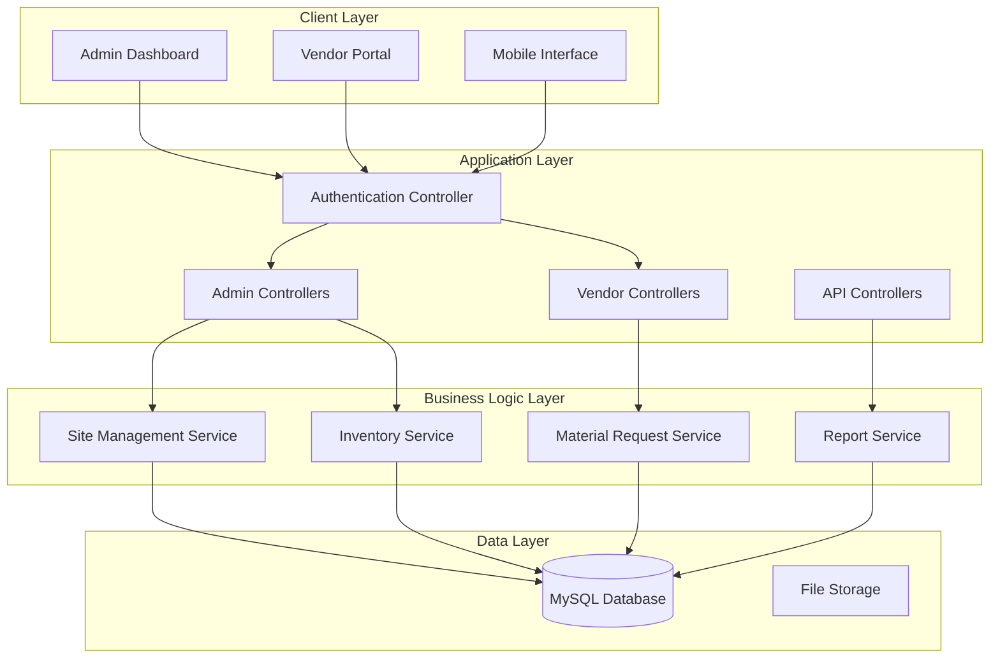
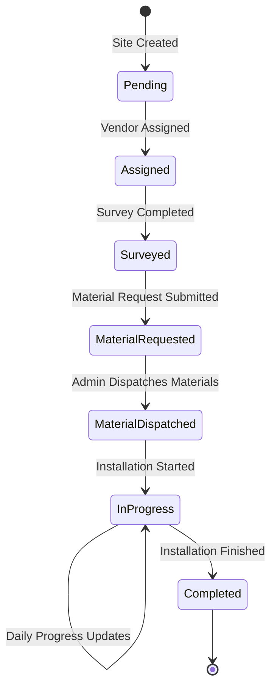

# Site Installation Management System - Design Document

## Overview

The Site Installation Management System is a web-based application built with PHP, MySQL, vanilla JavaScript, and Tailwind CSS. The system follows a traditional MVC architecture with role-based access control, supporting two primary user types: Administrators and Vendors. The application manages the complete workflow from site data entry through installation completion with comprehensive material tracking and reporting capabilities.

## Architecture

### System Architecture



### Technology Stack

- **Frontend**: HTML5, Vanilla JavaScript, Tailwind CSS
- **Backend**: PHP 8.0+
- **Database**: MySQL 8.0+
- **Web Server**: Apache/Nginx
- **Authentication**: Session-based with role management
- **File Handling**: Local file system for document storage

## Components and Interfaces

### Database Schema

#### Core Tables

**users**
- id (PRIMARY KEY)
- username, email, password_hash
- role (admin/vendor)
- status (active/inactive)
- created_at, updated_at

**locations**
- id (PRIMARY KEY)
- country, state, city
- created_at, updated_at

**sites**
- id (PRIMARY KEY)
- site_name, location_id
- client_details (JSON)
- assigned_vendor_id
- status (pending/assigned/surveyed/in_progress/completed)
- created_at, updated_at

**boq_items**
- id (PRIMARY KEY)
- item_name, item_code
- description, unit
- created_at, updated_at**in
ventory**
- id (PRIMARY KEY)
- boq_item_id (FOREIGN KEY)
- current_stock, reserved_stock
- unit_cost
- last_updated

**site_surveys**
- id (PRIMARY KEY)
- site_id (FOREIGN KEY)
- vendor_id (FOREIGN KEY)
- survey_data (JSON)
- survey_date
- status (draft/submitted)

**material_requests**
- id (PRIMARY KEY)
- site_id (FOREIGN KEY)
- vendor_id (FOREIGN KEY)
- request_data (JSON)
- status (pending/approved/dispatched)
- created_at, updated_at

**material_dispatches**
- id (PRIMARY KEY)
- material_request_id (FOREIGN KEY)
- dispatch_items (JSON)
- courier_name, tracking_number
- dispatch_date
- acknowledgment_status (pending/received)

**installation_progress**
- id (PRIMARY KEY)
- site_id (FOREIGN KEY)
- vendor_id (FOREIGN KEY)
- progress_date
- materials_used (JSON)
- work_description
- created_at

### Application Structure

```
/site-installation-management/
├── config/
│   ├── database.php
│   ├── auth.php
│   └── constants.php
├── controllers/
│   ├── AuthController.php
│   ├── AdminController.php
│   ├── VendorController.php
│   └── ApiController.php
├── models/
│   ├── User.php
│   ├── Site.php
│   ├── Inventory.php
│   ├── MaterialRequest.php
│   └── Report.php
├── views/
│   ├── admin/
│   │   ├── dashboard.php
│   │   ├── sites/
│   │   ├── inventory/
│   │   └── reports/
│   ├── vendor/
│   │   ├── dashboard.php
│   │   ├── sites/
│   │   └── materials/
│   └── auth/
│       ├── login.php
│       └── logout.php
├── assets/
│   ├── css/
│   ├── js/
│   └── uploads/
├── includes/
│   ├── header.php
│   ├── footer.php
│   └── navigation.php
└── index.php
```

## Data Models

### Site Management Flow



### Material Request Workflow

```mermaid
sequenceDiagram
    participant V as Vendor
    participant S as System
    participant A as Admin
    participant I as Inventory
    
    V->>S: Submit Material Request
    S->>A: Notify Admin of Request
    A->>I: Check Stock Availability
    I->>A: Return Stock Status
    A->>S: Process Dispatch
    S->>V: Notify Dispatch Details
    V->>S: Acknowledge Receipt
    S->>I: Update Stock Levels
```#
# User Interface Design

### Admin Dashboard Layout

- **Header**: Navigation menu with user info and logout
- **Sidebar**: Main menu items (Sites, Inventory, Reports, etc.)
- **Main Content**: Dynamic content area with breadcrumbs
- **Footer**: System info and version

### Key Interface Components

**Site Management Interface**
- Site listing with search and filter capabilities
- Add/Edit site forms with location dropdowns
- Bulk upload interface for CSV/Excel files
- Vendor assignment interface with availability checking

**Inventory Management Interface**
- Stock level dashboard with low-stock alerts
- Material dispatch form with BOQ item selection
- Dispatch tracking with courier integration
- Stock adjustment and audit trail

**Vendor Portal Interface**
- Assigned sites dashboard with status indicators
- Site survey form with photo upload capability
- Material request form with BOQ item lookup
- Installation progress tracking with daily entry forms

## Error Handling

### Application-Level Error Handling

**Database Errors**
- Connection failures: Graceful degradation with retry mechanism
- Query errors: Detailed logging with user-friendly messages
- Transaction failures: Automatic rollback with error reporting

**Authentication Errors**
- Invalid credentials: Clear error messages with attempt limiting
- Session expiry: Automatic redirect to login with return URL
- Unauthorized access: Role-based error pages with proper HTTP codes

**Validation Errors**
- Form validation: Client-side and server-side validation with clear feedback
- File upload errors: Size and type validation with progress indicators
- Data integrity: Foreign key constraint violations with meaningful messages

**Business Logic Errors**
- Insufficient inventory: Clear stock availability messages
- Duplicate entries: Conflict resolution with merge options
- Workflow violations: Status-based validation with next step guidance

### Error Logging and Monitoring

- Centralized error logging to database and files
- Email notifications for critical system errors
- User action audit trail for security and debugging
- Performance monitoring for slow queries and operations

## Testing Strategy

### Unit Testing Approach

**Model Testing**
- Database CRUD operations validation
- Business logic method testing
- Data validation and sanitization testing

**Controller Testing**
- HTTP request/response handling
- Authentication and authorization testing
- Input validation and error handling

### Integration Testing

**Workflow Testing**
- Complete site-to-installation workflow
- Material request and dispatch process
- User role and permission validation

**Database Integration**
- Transaction integrity testing
- Foreign key constraint validation
- Data consistency across related tables

### User Acceptance Testing

**Admin Workflow Testing**
- Site management and vendor assignment
- Inventory management and material dispatch
- Report generation and data export

**Vendor Workflow Testing**
- Site survey completion and submission
- Material request and acknowledgment
- Installation progress tracking

### Performance Testing

**Load Testing**
- Concurrent user access simulation
- Database query performance under load
- File upload and processing performance

**Security Testing**
- SQL injection prevention validation
- Cross-site scripting (XSS) protection
- Authentication bypass attempt testing
- Role-based access control validation